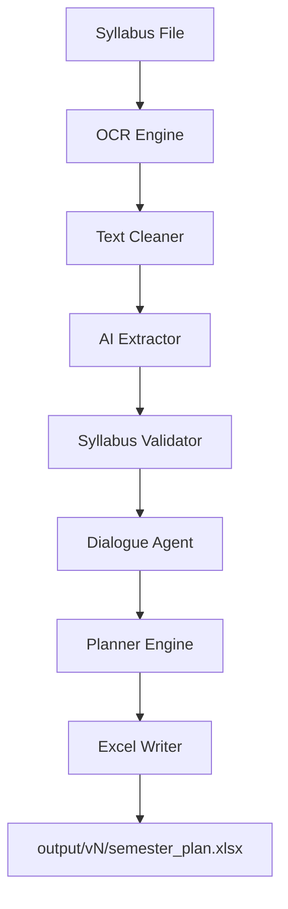

# Semester Planner AI 🎓

An intelligent study planner that converts your raw syllabus files (PDF, Image, DOCX) into a perfectly structured study schedule using OCR and Gemini AI.

## Features 🚀

-   **Multi-Format Ingestion**: Upload PDFs (scanned or text-based), Word docs, or images.
-   **AI-Powered Parsing**: Automatically extracts subjects, units, topics, and exam weightage using Gemini 1.5.
-   **Intelligent Validation**: Detects missing info and asks you clarifying questions via an interactive dialogue loop.
-   **Exam-Aware Scheduling**: Weight-based allocation that prioritizes important units and front-loads midterm topics.
-   **Revision Cycles**: Configurable buffers for final revisions.
-   **Output Versioning**: Keep track of every iteration in `output/v1`, `v2`, etc.
-   **Modern Web UI**: A beautiful, dark-themed browser interface built with Vite, React, and Tailwind CSS.

## Architecture 🏗️



## Setup & Installation 🛠️

### 1. Prerequisites
- **Python 3.10+**
- **Node.js 18+** (for Web UI)
- **Tesseract OCR**: [Install Tesseract](https://github.com/UB-Mannheim/tesseract/wiki) and ensure it's in your system PATH.
- **Poppler**: Required for PDF processing.

### 2. Environment Configuration
Create a `.env` file in the root directory:
```bash
GEMINI_API_KEY=your_google_ai_key_here
```

### 3. Backend Dependencies
```bash
pip install -r requirements.txt
```

### 4. Frontend Dependencies
```bash
cd web_ui
npm install
```

## Usage 📖

### Option A: Local Web UI (Recommended)
1. Start the API: `python web_api.py`
2. Start the UI: `cd web_ui && npm run dev`
3. Open `http://localhost:5173` in your browser.

### Option B: CLI Run
```bash
python main.py path/to/your/syllabus.pdf
```

## Project Structure 📂

- `planner/`: Core logic
    - `ingestion/`: OCR and text cleaning
    - `ai/`: Extraction and validation
    - `agent/`: Dialogue loop
    - `engine/`: Scheduling logic
    - `utils/`: Logging and date helpers
- `web_ui/`: React frontend
- `web_api.py`: FastAPI backend
- `main.py`: CLI entry point
- `output/`: Generated Excel plans (versioned)

---
Developed with ❤️ for students.
